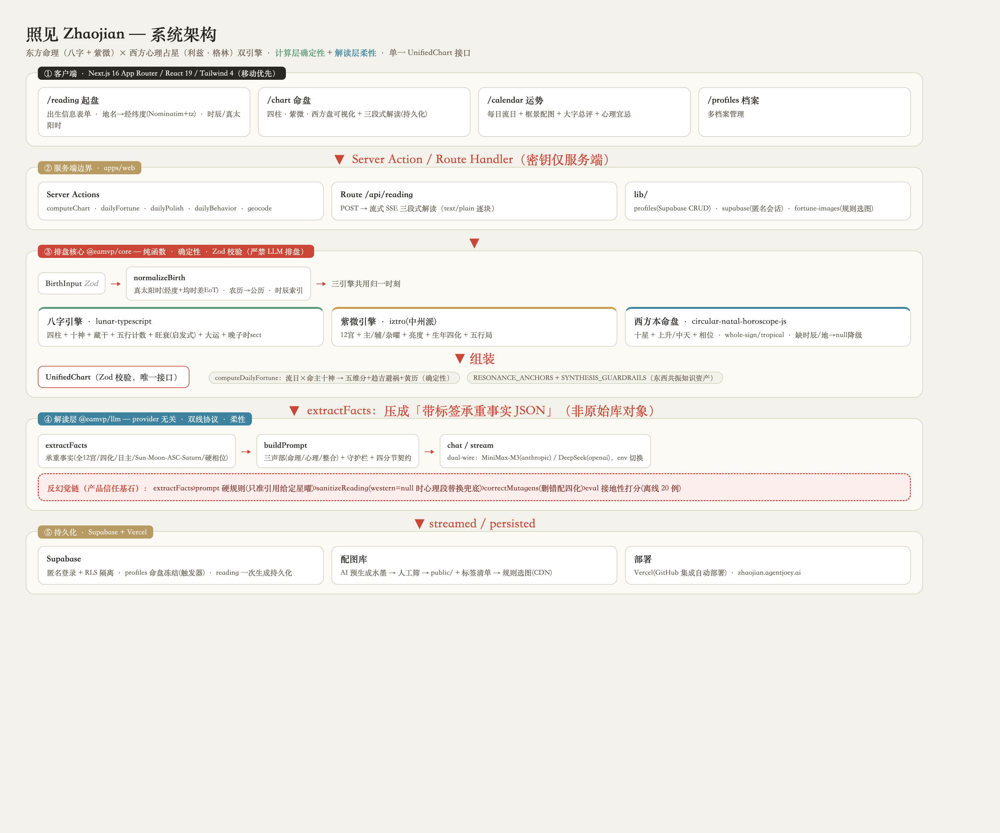
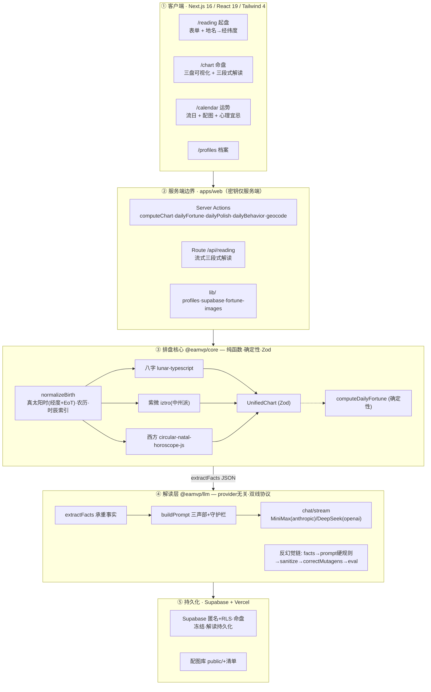

# Architecture — 照见 Zhaojian

> 东方命理（八字 + 紫微）× 西方心理占星（利兹·格林）双引擎。系统架构总览；PRD 见 Obsidian `P028-EasternAstrology`，调研依据见 `research/`，决策见 `docs/decisions/`。
> 现状：MVP 全链路已上线（https://zhaojian-mvp.vercel.app）。本文随引擎演进同步更新。

## 1. 设计总原则

1. **计算层确定性、解读层柔性。** 星曜/宫位/四化/四柱/行星位置一律由开源库精确计算（"just math"，错一处即崩塌信任）；自然语言解读由 LLM 生成，措辞概率化、非决定论。**严禁 LLM 自行排盘。**
2. **统一命盘 Schema 是唯一接口。** 三引擎只填充 `UnifiedChart`（Zod 校验）；解读层只读 `UnifiedChart` 抽出的「承重事实」。
3. **东西双盘并置，谨慎共振。** 两套体系作为「同一个人的两面镜子」并行解读；只在 `RESONANCE_ANCHORS` 标注的主题交汇处整合，禁止 1:1 等价。
4. **反思性、合规优先。** 心理占星 ≠ 临床心理；命理 = 自我反思工具而非预测神谕。强制免责声明 + 模型守护栏。

## 2. 架构图



<details><summary>Mermaid 源（可维护版）</summary>


</details>

## 3. 数据流（两条主路径）

**A. 建档解读（一次性，持久化）**
```
BirthInput → Zod 校验 → normalizeBirth(真太阳时+EoT / 农历 / 子时索引)
  → 三引擎共用归一时刻并行 → UnifiedChart(Zod) → createProfile(Supabase, 冻结)
  → /api/reading: extractFacts → 三声部 prompt → MiniMax-M3 流式
     → sanitize(西方降级兜底) → correctMutagens(四化纠正) → 四分节卡片 → 存档(不重算)
```

**B. 每日运势（确定性 + 轻 LLM）**
```
UnifiedChart.bazi + date → computeDailyFortune(流日×命主十神 → 五维分/趋吉避祸/黄历，纯函数)
  → 规则选配图(意境标签) + dailyPolish(一句润色) + dailyBehavior(心理行为宜忌)
  → 三者按 (档案,日期) localStorage 缓存，避免重复调 LLM
```

## 4. 模块边界

| 模块 | 职责 | 关键库 | 状态 |
|------|------|--------|------|
| `@eamvp/core` | 排盘 + 统一 Schema + 每日运势 + 共振映射 | lunar-typescript, iztro, circular-natal-horoscope-js, zod | ✅ 上线（core 22 测试） |
| `@eamvp/llm` | 承重事实 + 三声部 Prompt + 双线 LLM 客户端 + 反幻觉链 + eval | fetch（provider 无关） | ✅ 上线（llm 26 测试） |
| `apps/web` | 表单 + 命盘可视化 + 运势日历 + 档案 | Next.js 16, Supabase, tz-lookup | ✅ 上线 |

## 5. 解读层细节（反幻觉是重点）

- **三声部**（`buildSystemPrompt`）：命理声部（紫微/八字）｜心理声部（格林/荣格）｜整合声部（仅在 `RESONANCE_ANCHORS` 谈共振）。守护栏 + 共振锚点从 core 单一事实源取。输出契约 = **markdown 四分节**（概览/命理/心理/成长），不依赖 json_schema。
- **反幻觉链（四道 + 评测）**：
  1. `extractFacts` 只喂承重事实（全 12 宫主星 + 生年四化 + 日主旺衰 + Sun/Moon/ASC/Saturn/硬相位），模型不得引用未给出的星曜/行星。
  2. prompt 硬规则：紫微星只准引用 facts 中出现的；空宫走三方四正；四化用 `birthMutagens` 精确配对。
  3. `sanitizeReading`：western=null 时无论模型写什么，心理段整段替换为固定提示（杜绝杜撰行星）。
  4. `correctMutagens`：确定性删除错配的「X化禄/权/科/忌」断言（引擎四化 = 标准表，错配必为模型幻觉）。
  5. `eval/`：离线接地性打分（20 例语料，scorer 检查接地/四化/守护栏/格式）。
- **双线协议**（`provider.ts` / `client.ts`）：`anthropic`（MiniMax-M3 Coding Plan，`/v1/messages`，SSE content_block_delta）/ `openai`（DeepSeek，`/chat/completions`）。换模型 = 改 env，无需改码。

## 6. 关键技术约定（陷阱）

- **iztro v2.5.8**：`astro.config({ algorithm: 'default'|'zhongzhou' })`（**非**旧版 `configure({mutagen})`），默认中州派。
- **iztro `timeIndex` 0–12**：是时辰索引非小时；晚子时(23:xx)=12，用 `hourToTimeIndex`。
- **真太阳时**：normalize 层统一 = 经度平太阳时校正 + 均时差 EoT（±~16min）；三引擎共用，保证四柱/星盘时刻一致。
- **晚子时归日**：`ziHourConvention` → lunar `EightChar.setSect`（`current`=算当天 sect2 默认 / `next`=算次日 sect1）。
- **日主旺衰**：当前为启发式（得令/坐下/印比加权占比 → strong/weak/balanced），非用神级精算（见 §7 优化项）。
- **西方盘可降级**：缺纬度/时辰未知 → `western=null`，仅出东方双盘 + 心理段降级提示。
- **Swiss Ephemeris(AGPL) 规避**：用公有领域 circular-natal-horoscope-js（占星精度足够）。
- **持久化**：Supabase 匿名登录 + RLS 按设备隔离；命盘建档即冻结（DB 触发器禁改 chart/birth_input）；解读一次生成后存 `reading` 列，回访不重算。

## 7. 已知局限 / 优化方向（引擎评估，2026-06）

**命理深度（产品价值最高）**
- 旺衰仅用主气加权，未纳入藏干层次/会合冲刑/调候 → 深化，或改为「输出证据(得令/通根/印比/克泄耗计数) + 启发式判读」让 LLM 自行权衡。
- 缺 **用神/喜忌**（八字解读的核心）→ 至少做扶抑用神，喂入 facts，支撑「宜近木/水」类接地建议。
- 紫微 **三方四正(借星)** 未在 facts 计算，空宫解读目前靠提示词而无据 → 计算命宫三方四正供模型接地。
- 每日运势分数按关系静态（同关系日恒同）→ 引入 **流日干支 × 本命四柱冲合刑害 + 用神**，做到千人千日。
- 西方 facts 偏薄 → 补 元素/模式平衡、命主星(chart ruler)、月相、最紧相位簇(T三角/星群)。

**工程健壮性 / 成本**
- prompt-cache「声称适合」但未真正接入（anthropic 线未发 `cache_control` 断点）→ 接入以省成本/延迟。
- LLM 客户端无重试/超时 → 加退避重试 + 超时（曾见瞬时失败）。
- 西方数据质量：行星 sign 为空串等静默兜底 → 加校验，异常即判失败。
- 缺生产侧接地性观测 → 轻量记录解读长度/分节完整/接地标记，捕捉回归。

**架构演进**
- 紫微 **大限/流年四化** 未做（时序解读仅八字流日）→ 补，支撑时间线层。
- whole-sign 宫制 → 可选 Placidus（格林学派常用）。

## 8. 非 MVP（后续评估）
关系合盘(synastry×合婚)、规则引擎(YAML)+RAG 知识库、大限/流年时序解读、账号升级(跨设备同步)、建档心理问卷。详见 `.agent/BACKLOG.md`。
