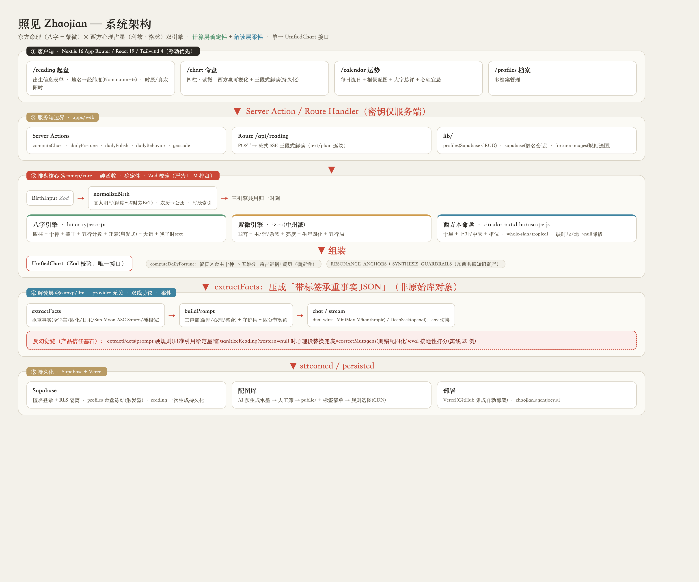
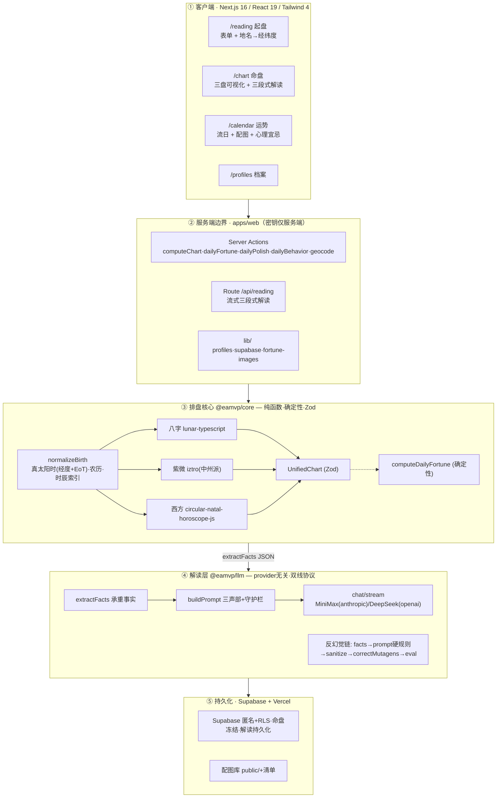

# Architecture — 照见 Zhaojian

> 东方命理（八字 + 紫微）× 西方心理占星（利兹·格林）双引擎。系统架构总览；PRD 见 Obsidian `P028-EasternAstrology`，调研依据见 `research/`，决策见 `docs/decisions/`。
> 现状：MVP 全链路已上线（https://zhaojian-mvp.vercel.app）。本文随引擎演进同步更新。

## 1. 设计总原则

1. **计算层确定性、解读层柔性。** 星曜/宫位/四化/四柱/行星位置一律由开源库精确计算（"just math"，错一处即崩塌信任）；自然语言解读由 LLM 生成，措辞概率化、非决定论。**严禁 LLM 自行排盘。**
2. **统一命盘 Schema 是唯一接口。** 三引擎只填充 `UnifiedChart`（Zod 校验）；解读层只读 `UnifiedChart` 抽出的「承重事实」。
3. **东西双盘并置，谨慎共振。** 两套体系作为「同一个人的两面镜子」并行解读；只在 `RESONANCE_ANCHORS` 标注的主题交汇处整合，禁止 1:1 等价。
4. **反思性、合规优先。** 心理占星 ≠ 临床心理；命理 = 自我反思工具而非预测神谕。强制免责声明 + 模型守护栏。

## 2. 架构图



<details><summary>Mermaid 源（可维护版）</summary>


```mermaid
flowchart TB
  subgraph CL["① 客户端 · Next.js 16 / React 19 / Tailwind 4"]
    R["/reading 起盘<br/>表单 + 地名→经纬度"]; C["/chart 命盘<br/>三盘可视化 + 三段式解读"]
    CAL["/calendar 运势<br/>流日 + 配图 + 心理宜忌"]; P["/profiles 档案"]
  end
  subgraph SV["② 服务端边界 · apps/web（密钥仅服务端）"]
    ACT["Server Actions<br/>computeChart·dailyFortune·dailyPolish·dailyBehavior·geocode"]
    API["Route /api/reading<br/>流式三段式解读"]; LIB["lib/ profiles·supabase·fortune-images"]
  end
  subgraph CORE["③ 排盘核心 @eamvp/core — 纯函数·确定性·Zod"]
    NB["normalizeBirth<br/>真太阳时(经度+EoT)·农历·时辰索引"]
    BZ["八字 lunar-typescript"]; ZW["紫微 iztro(中州派)"]; WE["西方 circular-natal-horoscope-js"]
    UC["UnifiedChart (Zod)"]; DF["computeDailyFortune (确定性)"]
    NB-->BZ & ZW & WE-->UC; UC-.->DF
  end
  subgraph LLM["④ 解读层 @eamvp/llm — provider无关·双线协议"]
    EF["extractFacts 承重事实"]-->PR["buildPrompt 三声部+守护栏"]-->CH["chat/stream<br/>MiniMax(anthropic)/DeepSeek(openai)"]
    GUARD["反幻觉链: facts→prompt硬规则→sanitize→correctMutagens→eval"]
  end
  subgraph PER["⑤ 持久化 · Supabase + Vercel"]
    SB["Supabase 匿名+RLS·命盘冻结·解读持久化"]; IMG["配图库 public/+清单"]
  end
  CL-->SV-->CORE-->|extractFacts JSON|LLM-->PER
```
</details>

## 3. 数据流（两条主路径）

**A. 建档解读（一次性，持久化）**
```
BirthInput → Zod 校验 → normalizeBirth(真太阳时+EoT / 农历 / 子时索引)
  → 三引擎共用归一时刻并行 → UnifiedChart(Zod) → createProfile(Supabase, 冻结)
  → /api/reading: extractFacts → 三声部 prompt → MiniMax-M3 流式
     → sanitize(西方降级兜底) → correctMutagens(四化纠正) → 四分节卡片 → 存档(不重算)
```

**B. 每日运势（确定性 + 轻 LLM）**
```
UnifiedChart.bazi + date → computeDailyFortune(流日×命主十神 → 五维分/趋吉避祸/黄历，纯函数)
  → 规则选配图(意境标签) + dailyPolish(一句润色) + dailyBehavior(心理行为宜忌)
  → 三者按 (档案,日期) localStorage 缓存，避免重复调 LLM
```

## 4. 模块边界

| 模块 | 职责 | 关键库 | 状态 |
|------|------|--------|------|
| `@eamvp/core` | 排盘 + 统一 Schema + 每日运势 + 共振映射 | lunar-typescript, iztro, circular-natal-horoscope-js, zod | ✅ 上线（core 22 测试） |
| `@eamvp/llm` | 承重事实 + 三声部 Prompt + 双线 LLM 客户端 + 反幻觉链 + eval | fetch（provider 无关） | ✅ 上线（llm 26 测试） |
| `apps/web` | 表单 + 命盘可视化 + 运势日历 + 档案 | Next.js 16, Supabase, tz-lookup | ✅ 上线 |

## 5. 解读层细节（反幻觉是重点）

- **三声部**（`buildSystemPrompt`）：命理声部（紫微/八字）｜心理声部（格林/荣格）｜整合声部（仅在 `RESONANCE_ANCHORS` 谈共振）。守护栏 + 共振锚点从 core 单一事实源取。输出契约 = **markdown 四分节**（概览/命理/心理/成长），不依赖 json_schema。
- **反幻觉链（四道 + 评测）**：
  1. `extractFacts` 只喂承重事实（全 12 宫主星 + 生年四化 + 日主旺衰 + Sun/Moon/ASC/Saturn/硬相位），模型不得引用未给出的星曜/行星。
  2. prompt 硬规则：紫微星只准引用 facts 中出现的；空宫走三方四正；四化用 `birthMutagens` 精确配对。
  3. `sanitizeReading`：western=null 时无论模型写什么，心理段整段替换为固定提示（杜绝杜撰行星）。
  4. `correctMutagens`：确定性删除错配的「X化禄/权/科/忌」断言（引擎四化 = 标准表，错配必为模型幻觉）。
  5. `eval/`：离线接地性打分（20 例语料，scorer 检查接地/四化/守护栏/格式）。
- **双线协议**（`provider.ts` / `client.ts`）：`anthropic`（MiniMax-M3 Coding Plan，`/v1/messages`，SSE content_block_delta）/ `openai`（DeepSeek，`/chat/completions`）。换模型 = 改 env，无需改码。

## 6. 关键技术约定（陷阱）

- **iztro v2.5.8**：`astro.config({ algorithm: 'default'|'zhongzhou' })`（**非**旧版 `configure({mutagen})`），默认中州派。
- **iztro `timeIndex` 0–12**：是时辰索引非小时；晚子时(23:xx)=12，用 `hourToTimeIndex`。
- **真太阳时**：normalize 层统一 = 经度平太阳时校正 + 均时差 EoT（±~16min）；三引擎共用，保证四柱/星盘时刻一致。
- **晚子时归日**：`ziHourConvention` → lunar `EightChar.setSect`（`current`=算当天 sect2 默认 / `next`=算次日 sect1）。
- **日主旺衰**：当前为启发式（得令/坐下/印比加权占比 → strong/weak/balanced），非用神级精算（见 §7 优化项）。
- **西方盘可降级**：缺纬度/时辰未知 → `western=null`，仅出东方双盘 + 心理段降级提示。
- **Swiss Ephemeris(AGPL) 规避**：用公有领域 circular-natal-horoscope-js（占星精度足够）。
- **持久化**：Supabase 匿名登录 + RLS 按设备隔离；命盘建档即冻结（DB 触发器禁改 chart/birth_input）；解读一次生成后存 `reading` 列，回访不重算。

## 7. 引擎深化 v2（✅ 已实施，2026-06，见 `specs/engine-v2-deepening.md`）

派生事实在 facts 层计算、不进冻结命盘（新旧命盘通吃、零迁移）。TDD 全程，core 45 + llm 30 测试。

**命理深度**（接入 extractFacts + prompt，实跑验证落地无幻觉）
- ✅ EP-502 `deriveStrength` 旺衰证据化（得令/通根藏干/同党异党/ratio），模型据证判断。
- ✅ EP-501 `deriveUsefulElements` 用神喜忌（扶抑法 + EP-002-cal-2 补齐调候：月支冬喜火暖局/夏喜水润局，春秋不强制微调）→ 成长段「宜近木/水、向东/北」接地建议。
- ✅ EP-503 `deriveTriad` 紫微三方四正借星 → 空宫据实接地。
- ✅ EP-504 `computeDailyFortune` 流日干支 × 本命四支冲合刑害 + 用神 → 千人千日 + 厚卦象。
- ✅ EP-505 `deriveWesternProfile` 元素/模式平衡、命主星、月相、星群。

**工程健壮性 / 成本**
- ✅ EP-511 prompt-cache：anthropic system 作 `cache_control` 块（实测 MiniMax-M3 支持）。
- ✅ EP-512 `withRetry`：5xx/429/网络错误退避重试 + 非流式 60s 超时。
- ✅ EP-513 `isWesternValid`：星座为空即降级 null。
- ✅ EP-514 `logReadingMeta`：无 PII 接地观测（model/分节/字数）。

**架构演进**
- ✅ EP-521 `computeZiweiHoroscope` 大限/流年四化 → **时序声部** `generateTimeline`，已接入 /chart「当下时序」卡（按年缓存、非事件预测、东西时序共振）。
- ✅ EP-522 `computeWesternChart(…, houseSystem)` 可选 Placidus（默认 whole-sign）。

## 7b. 风水「境」（✅ Layer 0 + Layer 1 + TG 适配均已实施，2026-08，见 `superpowers/specs/2026-08-14-fengshui-environment-design.md` 与 `2026-08-15-fengshui-telegram-adaptation.md`）

补齐「命·运·**境**」第三条线：人与居住空间的关系。`NEXT_PUBLIC_FENGSHUI_ENABLED` flag 门控，**2026-08-16 起线上已开启**（Production + Preview）。

**定位：派生层，不是第四个排盘引擎。** 不需要新的天文历法计算，输入全部来自已有 `UnifiedChart` + `BirthInput`，与 `deriveSpirit` 同层——纯函数、不进冻结命盘。Layer 0 零迁移；Layer 1 新增两张**独立**表（`0011_dwellings`），不改动既有表。

**`packages/core/src/fengshui/`（确定性，9 模块）**
- `ming-gua` 本命卦：三元式 男 `(2−Y) mod 9` / 女 `(Y−5) mod 9`，5 为中宫则男寄坤、女寄艮。**立春年不重算**——从已算好的 `chart.bazi.pillars.year` 干支在公历年 ±1 窗口内反查，天然与八字引擎一致。
- `eight-mansions` 八宅游年 8×8 查表（依大游年歌，逐格对拍）→ 每方位 生气/天医/延年/伏位 · 绝命/五鬼/六煞/祸害。
- `directions` 方位基础 + 五行→方位/色/材；`env-psych` 风水↔环境心理学对照表 + `FENGSHUI_GUARDRAILS`。
- `remedy` 化解方案：**成本分级**（零成本/挪动/添置/装修）+ 租房可行性，零成本优先排序。
- `object-advisor` 物件顾问：物件五行 × 品类硬规则 × 命卦吉方（可选叠加宅八方，见下方 ⚠️）。
- `dwelling`（Layer 1）宅卦：`facing` → 坐 = `OPPOSITE[facing]` → 宅卦 → 房屋八方 + `matchWithPerson`。
- `cohabitants`（Layer 1）合看：`conflicts` = 主人吉且此人凶；`sharedGood` = 双方皆吉。**同一套房子对不同住客吉凶不同，这是八宅的直接结论，不是「因人而异的感受」。**
- `index` `computeFengshui` 汇总（复用传入命盘的 `chart.bazi`，不重复排盘）。`FengshuiChart` 是**判别联合**：`layer: 0` 无 `dwelling`/`cohabitants`，`layer: 1` 两者必有——非法状态不可表示。

⚠️ **物件顾问「强版」与弱版的推荐方位逐字节相同。** 八宅结构决定 `命卦吉方 ∩ 宅卦吉方` **只可能是 4 或 0**（某人的四吉方恰好就是其东/西四命组的四个方位，同组则全留、异组则全不留；枚举 8×8 全组合与 276,480 组输入两次独立验证）。所以 `object-advisor` 里的 `usable ≡ good`，传 `dwellingSectors` 唯一多出来的可观察内容是 `dwellingNote`（且只在异组时非空）。**不要再基于「强版会给出不同推荐方位」做设计**——`packages/core/src/fengshui/object-advisor.ts` 与三个下游文件的注释都记着这条。

**诚实标注（产品核心可信度）**：`Remedy` / `EnvPsychAnchor` 均为**判别联合**——`evidence: '传统象征' ⇒ modern: null`，由编译器强制。传统有说法、现代机制没有对应解释的做法（金泄五黄、水景催财），不假装有科学依据，改用「仪式与掌控感」框架呈现。

**`packages/llm/src/fengshui/`（解说层，反幻觉四道全在真实路径上）**
`extractFengshuiFacts`（字段白名单闸门，新增字段会让测试失败）→ prompt 硬规则（复用 core 守护栏 + 八星白名单）→ `sanitizeFengshui`（删「传统象征」条目上的伪科学措辞）→ `verifyDirectionConsistency`（方位吉凶来自查表，**模型输出可机械对拍**，不符即纠正并记 `corrections`）。
- `generateFengshuiReading` 返回 `degraded`（= `corrections` 非空）：纠正只救得回星名、救不回建立在错方位上的整段叙述，调用方据此降级或重生成。
- ⚠️ 两道机械校验目前**仅中文有效**，`en` 输出不被校验（`detectLocale()` 对任何非中文浏览器返回 `en`，所以这是多数访客的默认路径，不是边缘情况——见 BACKLOG `EP-fs-en`）；`adviseObjectText` 只有 prompt 硬规则这一道。
- **`verifyDirectionConsistency` 认识两张八方表**（Layer 1 起）。「本命八方」由命卦定、「房屋八方」由宅卦定，同一方位在两表里经常是不同的星。校验器按「分句→整句→块」三层递进窗口解析每句归属，每层要求恰好一套标记；**无法归属则弃权**（不改写、不记 correction），除非两表对该方位给出同一颗星。Layer 0 从不调用归属解析。
  - 刻意的覆盖取舍：Layer 1 里「无标记、非列表行、且两表判语不同」的方位陈述不再被校验。本校验器的历史失败模式是**过度纠正**，代价不对称（叙述被扣 + 无上限 LLM 花费 vs 四道里少一道备份）。要收回这块覆盖，正确做法是收紧 `prompt.ts` 的标记要求，而不是让校验器猜。

**`apps/web`**
- 页面：`/fengshui`（Tab：盘 / 化解 / 物件；八方位盘图 `BaguaWheel` + 分节叙述 + 化解清单 + 合看 chips）、`/fengshui/dwellings`（居所增删改）、`/fengshui/object`（物件顾问表单——注意 `/fengshui` 的「物件」tab 只是带链接的引导卡，表单只存在于这个独立页）。
- 路由：`api/fengshui/{reading,object}`（web）+ `api/tg/fengshui`（TG 中介）。闸门规则抽在 `lib/fengshui-reading.ts` 的 `isFengshuiEntitledForUid`，**两条路由共用单一事实源**：`BILLING_ENABLED !== "1"` 无条件放行、`!uid` fail-closed。
- 持久化：报告存 `fengshui_reports` 表，按 `(uid, input_fingerprint)` upsert（`fengshuiFingerprint()` djb2）。**波 1 的 localStorage 缓存已删除**（`lib/fengshui-cache.ts` 不再存在）。
- 宿主分流收口在**数据层**（`lib/dwellings.ts` / `lib/fengshui-report.ts` 按 `hasTgSession()` 分流），页面只调 `listDwellings()`，不关心自己在哪个宿主里。
- **降级是设计内路径**：盘图、着色、化解清单、物件建议全部确定性计算，LLM 挂了页面仍完整可用，只少叙述文字。

**会员边界（spec §11）**：免费 = Layer 0 + 物件顾问；会员 = 住宅实盘 + 分级化解 + 合看。全部受 `BILLING_ENABLED` 门控，该 env 不为 `"1"`（默认）时无任何限制。**多套居所曾被闸门挡住，最终评审已撤除**——`/fengshui` 与 `/fengshui/object` 都硬取 `dwellings[0]`，第 2 套不被任何代码读取，为零可观察产出收费不可辩护。日后做切换器需**同时**新建服务端写入路由（`createDwelling` 是浏览器直写 Supabase，届时纯客户端闸门可绕过）。

**未实施**：Layer 2 玄空飞星（`dwellings` schema 已为其预留可空字段）、物件级化解。

## 8. 非 MVP（后续评估）
关系合盘(synastry×合婚)、规则引擎(YAML)+RAG 知识库、大限/流年时序解读、账号升级(跨设备同步)、建档心理问卷。详见 `.agent/BACKLOG.md`。
